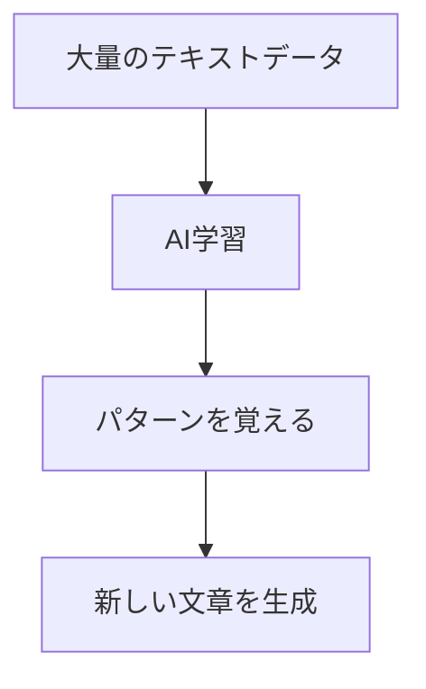

<style>
.text-gradient {
  background: linear-gradient(135deg, #667eea 0%, #764ba2 100%);
  -webkit-background-clip: text;
  background-clip: text;
  color: transparent;
  font-weight: bold;
}
.highlight {
  background: linear-gradient(135deg, #ffecd2 0%, #fcb69f 100%);
  color: #333;
  padding: 0.3em 0.6em;
  border-radius: 0.5em;
  font-weight: bold;
  box-shadow: 0 4px 15px rgba(0,0,0,0.1);
}
.card {
  background: rgba(255, 255, 255, 0.1);
  backdrop-filter: blur(10px);
  border-radius: 1rem;
  padding: 1.5rem;
  border: 1px solid rgba(255, 255, 255, 0.2);
  box-shadow: 0 8px 32px rgba(0,0,0,0.1);
}
.icon-large {
  font-size: 4rem;
  margin-bottom: 1rem;
}

/* Slidev表示の安定化 */
.slidev-page {
  transition: all 0.3s ease-in-out !important;
}

.slidev-layout {
  min-height: auto !important;
}
</style>

# <span class="text-gradient">生成AIって何？どう使うの？</span>

## <span class="highlight">学生のための生成AI入門講座</span>

<div class="pt-12">
  <span @click="$slidev.nav.next" class="px-4 py-2 rounded-lg cursor-pointer bg-gradient-to-r from-blue-500 to-purple-600 text-white hover:from-blue-600 hover:to-purple-700 transition-all duration-300">
    講義を開始する <carbon:arrow-right class="inline"/>
  </span>
</div>

<div class="abs-br m-6 flex gap-2">
  <span class="text-sm opacity-50">90分講義 | 実践的なAI活用術</span>
</div>

---
layout: default
---

# 今日の講義内容

<div class="grid grid-cols-2 gap-8">

<div>

## 📚 学習内容
- **生成AIとは何か？**
- **ChatGPTの基本的な使い方**
- **画像生成AIの紹介**
- **🚀 実践：AIポータルアプリ体験（重点）**
  - AIツール診断（60個のツールから最適な組み合わせを発見）
  - AI画像生成
  - 読み上げAI
  - AI模擬面接官
  - ご当地グルメ案内
- **🎯 60個のAIツールを実際に体験**
- **技術的な学びと今後の活用**

</div>

<div>

## ⏰ 時間配分（90分）
- 生成AIの基礎知識：8分
- ChatGPTの紹介：12分
- 画像生成AIの紹介：8分
- **実践体験（AIポータル5機能）：35分**
- **🎯 60個のAIツール体験：20分**
- 技術的な学び：5分
- まとめ・質疑応答：2分

</div>

</div>

---
layout: default
---

# AIの種類を整理してみよう

<div class="grid grid-cols-2 gap-8">

<div>

## 🔍 従来の技術・システム
- **検索エンジン**（Google、Yahoo!）
- **推薦システム**（YouTube、Netflix）
- **音声認識**（Siri、Alexa）
- **翻訳**（Google翻訳）
- **ゲームAI**（将棋、囲碁）

<div class="mt-4 p-3 bg-sky-100 rounded">
💡 <strong>特徴</strong>：決められたルール・アルゴリズムで動作
</div>

</div>

<div>

## ✨ 生成AI（新しいAI）
- **文章生成**（ChatGPT, Gemini）
- **画像生成**（DALL-E、Midjourney, Gemini Canvas）
- **音楽生成**（Suno）
- **動画生成**（Veo2, Runway, Google AI Studio）
- **コード生成**（GitHub Copilot, Claude）

<div class="mt-4 p-3 bg-emerald-100 rounded">
💡 <strong>特徴</strong>：新しいコンテンツを創造
</div>

</div>

</div>

---
layout: center
class: text-center
---

# 生成AIとは？

<div class="text-2xl mb-8">
<span class="highlight">人間のように新しいコンテンツを作り出すAI</span>
</div>

<div class="grid grid-cols-3 gap-8 mt-12">

<div class="text-center">
  <div class="text-6xl mb-4">📝</div>
  <h3>文章を書く</h3>
  <p class="text-sm opacity-75">レポート、メール、小説など</p>
</div>

<div class="text-center">
  <div class="text-6xl mb-4">🎨</div>
  <h3>絵を描く</h3>
  <p class="text-sm opacity-75">イラスト、写真、デザインなど</p>
</div>

<div class="text-center">
  <div class="text-6xl mb-4">💭</div>
  <h3>考える</h3>
  <p class="text-sm opacity-75">質問に答える、アイデア出しなど</p>
</div>

</div>

---
layout: default
---

# 💡 身近な生成AIの活用例

<div class="grid grid-cols-2 gap-6">

<div class="card">

## 📱 メルカリの商品説明自動生成

<div class="text-center">
  <div class="text-4xl mb-3">📸</div>
  <h3 class="text-lg font-bold mb-2">写真撮影だけで商品説明を自動生成</h3>
</div>

**機能：**
- 商品の写真を撮影するだけ
- AIが商品を自動認識
- 基本的な雛形を自動生成

<div class="mt-3 p-3 bg-green-100 rounded text-sm">
💡 <strong>学生にも身近</strong>：フリマアプリで実際に体験できるAI機能
</div>

</div>

<div class="card">

## 🎯 他の身近な例

**LINE AI**
- 画像生成
- AI検索

**Google Lens**
- 物体認識・説明

<div class="mt-3 p-3 bg-blue-100 rounded text-sm">
💡 <strong>気づかないうちに</strong>：日常でAIを活用している
</div>

</div>

</div>

---
layout: default
---

# 生成AIの仕組み（簡単に）

<div class="grid grid-cols-2 gap-4">

<div>

## 🧠 学習プロセス



</div>

<div>

## 📚 学習データの例
- **ウィキペディア**の記事
- **ニュース**記事
- **小説**や**詩**
- **論文**や**教科書**

<div class="mt-4 p-3 bg-amber-100 rounded">
⚠️ <strong>注意</strong>：学習データの質が生成結果に影響
</div>

</div>

</div>

---
layout: center
class: text-center
---

# 第1部：ChatGPTって何？

<div class="text-6xl mb-8">🤖💬</div>

<div class="text-xl mb-4">
世界で最も有名な生成AI
</div>

<div class="text-lg opacity-75">
OpenAI社が開発した対話型AI
</div>

---
layout: default
---

# ChatGPTの基本情報

<div class="grid grid-cols-2 gap-8">

<div>

## 📊 基本データ
- **開発会社**：OpenAI（アメリカ）
- **公開日**：2022年11月30日
- **ユーザー数**：1億人以上（2023年）
- **対応言語**：100以上の言語
- **日本語**：高精度で対応

</div>

<div>

## 💰 料金プラン
- **無料版**：基本的な機能
- **有料版**：月額20ドル
  - より高性能なモデル
  - 画像生成機能
  - プラグイン機能

</div>

</div>

<div class="mt-8 p-4 bg-indigo-100 rounded">
💡 <strong>本格的な使用には有料版が必要(トークン上限など)</strong>
</div>

---
layout: default
---

# ChatGPTでできること

<div class="grid grid-cols-2 gap-6">

<div>

## 📝 文章作成
- **レポート**の下書き
- **メール**の文面
- **自己紹介文**
- **履歴書**の志望動機
- **プレゼン**の構成

## 🤔 質問・相談
- **勉強**の質問
- **進路**の相談
- **悩み事**の相談
- **アイデア**出し

</div>

<div>

## 📚 学習支援
- **要約**作成
- **翻訳**
- **語学**学習
- **プログラミング**学習
- **数学**の解説

## 🎯 その他
- **スケジュール**作成
- **料理**レシピ
- **旅行**プラン
- **ゲーム**の相手

</div>

</div>

---
layout: default
---

# ChatGPTの使い方（基本）

<div class="grid grid-cols-2 gap-8">

<div>

## 🌐 アクセス方法
1. **ブラウザ**で「ChatGPT」と検索
2. **[chatgpt.com](https://chatgpt.com/)**にアクセス
3. **アカウント**を作成（無料）
4. **ログイン**して使用開始

<div class="mt-4 p-3 bg-teal-100 rounded">
✅ <strong>必要なもの</strong>：メールアドレスのみ
</div>

</div>

<div>

## 💬 基本的な使い方
1. **質問**を入力
2. **Enter**キーを押す
3. **回答**を待つ（数秒）
4. **追加質問**も可能

<div class="mt-4 p-3 bg-cyan-100 rounded">
💡 <strong>コツ</strong>：具体的に質問すると良い回答が得られる
</div>

</div>

</div>

---
layout: default
---

# AIへの質問の仕方

<div class="grid grid-cols-2 gap-6">

<div>

## ❌ あまり良くない例

<div class="bg-rose-100 p-4 rounded mb-4">
「レポートを書いて」
</div>

<div class="bg-rose-100 p-4 rounded mb-4">
「英語を教えて」
</div>

<div class="bg-rose-100 p-4 rounded">
「おすすめを教えて」
</div>

<div class="mt-4 text-sm opacity-75">
→ 抽象的すぎて、期待する回答が得られない
</div>

</div>

<div>

## ✅ 良い例

<div class="bg-lime-100 p-4 rounded mb-4">
「環境問題について800字のレポートを書いて」
</div>

<div class="bg-lime-100 p-4 rounded mb-4">
「英語の過去形の使い方を例文付きで教えて」
</div>

<div class="bg-lime-100 p-4 rounded">
「大学生におすすめの読書習慣を3つ教えて」
</div>

<div class="mt-4 text-sm opacity-75">
→ 具体的で、明確な回答が期待できる
</div>

</div>

</div>

---
layout: default
---

# 🎯 七里式プロンプト「8+1の公式」の構成要素

<style>
.grid-container {
  margin: 0.2rem 0 !important;
}
.card {
  min-height: auto;
  padding: 0.25rem;
  margin-bottom: 0.1rem;
  line-height: 1.2;
}
.card h6 {
  margin: 0.1rem 0;
  line-height: 1.2;
}
.text-xs {
  line-height: 1.1;
  margin-top: 0.1rem;
}
.plus-one {
  margin-top: 0.3rem;
  margin-bottom: 0.3rem;
  padding: 0.3rem;
}
</style>

<div class="grid grid-cols-2 gap-1 grid-container">

<div class="card p-1">

###### 1. 前提条件
**依頼者・制作者・目的**を提示
<div class="text-xs text-gray-600">
例：「大学生の私が」「環境問題のレポートを」
</div>

</div>

<div class="card p-1">

###### 5. 形容詞
**名詞を修飾**して精度を向上
<div class="text-xs text-gray-600">
例：「簡潔な」「詳細な」
</div>

</div>

<div class="card p-1">

###### 2. 対象プロファイル
**対象**を設定して目標を明確化
<div class="text-xs text-gray-600">
例：「高校生向け」「初心者レベル」
</div>

</div>

<div class="card p-1">

###### 6. 出力形式
**出力の形式**を指定する
<div class="text-xs text-gray-600">
例：「箇条書き」「表形式」
</div>

</div>

<div class="card p-1">

###### 3. 参考情報
**回答作成に必要な情報**を示す
<div class="text-xs text-gray-600">
例：「最新のデータ」「具体例」
</div>

</div>

<div class="card p-1">

###### 7. 参考フォーマット
**文章構造**を参考にするよう指定
<div class="text-xs text-gray-600">
例：「PREP法」「起承転結」
</div>

</div>

<div class="card p-1">

###### 4. 名詞と動詞
**何をすべきか**を名詞と動詞で指示
<div class="text-xs text-gray-600">
例：「作成する」「分析する」
</div>

</div>

<div class="card p-1">

###### 8. 文体指定
**スタイル・トーン**を定義
<div class="text-xs text-gray-600">
例：「丁寧語」「カジュアル」
</div>

</div>

</div>

<div class="plus-one bg-blue-50 rounded text-center text-xs">
💡 <strong>プラス1</strong>：再度指示で精度が上がる<br>
「もっと詳しく」「具体例を追加して」
</div>

---
layout: default
---

# 学生生活での活用例

<div class="grid grid-cols-2 gap-6">

<div>

## 📖 勉強関連

**例1：レポート作成**
```text
「SDGsについて1000字のレポートの
構成を考えて」
```

**例2：試験対策**
```text
「日本史の明治維新について
重要ポイントを5つ教えて」
```

**例3：語学学習**
```text
「『I am studying』を他の表現で
3通り教えて」
```

</div>

<div>

## 🌟 生活関連

**例4：就活準備**
```text
「IT企業の志望動機の書き方を
例文付きで教えて」
```

**例5：プレゼン準備**
```text
「5分間の自己紹介プレゼンの
構成を考えて」
```

**例6：悩み相談**
```text
「友人関係で悩んでいます。
アドバイスをください」
```

</div>

</div>

---
layout: center
class: text-center
---

# 第2部：画像生成AIの世界

<div class="text-6xl mb-8">🎨🤖</div>

<div class="text-xl mb-4">
文字で絵を描く魔法
</div>

<div class="text-lg opacity-75">
「テキストから画像を生成」する技術
</div>

---
layout: default
---

# 主な画像生成AI

<div class="grid grid-cols-2 gap-8">

<div>

## 🎯 DALL-E 3
- **開発**：OpenAI
- **特徴**：ChatGPTと連携
- **料金**：ChatGPT Plus（月額20ドル）
- **品質**：非常に高い

## 🎨 Midjourney
- **開発**：Midjourney社
- **特徴**：アート性が高い
- **料金**：月額10ドル〜
- **利用**：Discord経由

</div>

<div>

## 🎯 Gemini Canvas
- **開発**：Google
- **特徴**：Geminiと連携
- **料金**：Gemini Pro<br>（月額2,900円; 大学生は1年間無料）
- **品質**：非常に高い

## 🆓 (一部)無料で使えるもの
- **Stable Diffusion** <br>
（環境整備まで技術的な知識が必要）
- **Canva AI**

</div>

</div>

---
layout: default
---

# 画像生成AIの使い方

<div class="grid grid-cols-2 gap-8">

<div>

## 📝 プロンプト（指示文）の書き方

**基本構造：**
```text
[主題] + [スタイル] + [詳細]
```

**例：**
```text
「猫 + 水彩画風 + 花畑にいる」
→ 「花畑にいる猫を水彩画風で」
```

</div>

<div>

## 🎨 スタイルの例
- **写真風**：「photorealistic」
- **アニメ風**：「anime style」
- **水彩画風**：「watercolor」
- **油絵風**：「oil painting」
- **ピクサー風**：「Pixar style」
- **ジブリ風**：「Studio Ghibli style」

</div>

</div>

<div class="mt-8 p-4 bg-orange-100 rounded">
⚠️ <strong>注意</strong>：著作権や肖像権に配慮した使用を心がけましょう
</div>

---
layout: default
---

# 学生生活での画像生成AI活用

<div class="grid grid-cols-2 gap-6">

<div>

## 📚 学習・研究
- **プレゼン**用のイラスト
- **レポート**の図解
- **研究発表**のビジュアル
- **ポスター**作成
- **概念図**の作成

## 🎯 プロジェクト
- **サークル**のロゴ
- **イベント**のポスター
- **SNS**用の画像
- **ブログ**のアイキャッチ

</div>

<div>

## 💡 アイデア出し
- **デザイン**の参考
- **コンセプト**の可視化
- **ブレインストーミング**の補助
- **創作活動**のインスピレーション

## 🎨 趣味・創作
- **オリジナル**キャラクター
- **架空の風景**
- **ファンアート**
- **壁紙**作成

</div>

</div>

---
layout: default
---

# 🖼️ 画像生成AIの実例

<div class="grid grid-cols-2 gap-4 mt-4">

<div class="card">

<div class="text-center">
  
</div>

<div class="text-center mt-3">
  
</div>

</div>

<div class="card">

<div class="text-center">
  
</div>

<div class="text-center mt-3">
  
</div>

</div>

</div>

<div class="mt-4 p-3 bg-blue-50 rounded text-sm">
💡 <strong>これらの画像は全てAIが生成したものです</strong><br>
プロンプトの書き方次第で、様々なシーンやキャラクターを自由に作成できます
</div>

---
layout: default
---

# 🖼️ 動画生成AIの実例

<div class="grid grid-cols-2 gap-4 mt-4">

<div class="card">

## 動画生成例 1

<div class="text-center">
    <a href="https://drive.google.com/file/d/12rmQofkcspQudN6fUnFhFWAjhtnb77nR/view?usp=sharing" target="_blank">
      AI生成動画 1
    </a>
</div>

</div>

<div class="card">

## 動画生成例 2

<div class="text-center">
    <a href="https://drive.google.com/file/d/1RZp4ujmH9MY6KN2JFBCypJl2WASiDTtx/view?usp=sharing" target="_blank">
      AI生成動画 2
    </a>
</div>

</div>

</div>

<div class="mt-4 p-3 bg-blue-50 rounded text-sm">
💡 <strong>これらの動画は全てAIが生成したものです</strong><br>
テキストプロンプトから1~3分で動画を作成できます
</div>

---
layout: center
class: text-center
---

# 🚀 実践体験タイム！

<div class="text-6xl mb-8">💻✨</div>

<div class="text-xl mb-4">
実際に動くAIポータルアプリを体験してみましょう
</div>

<div class="text-lg opacity-75">
今から紹介する5つのAI機能を<br>
実際に使ってみてください
</div>

<div class="mt-8 p-4 bg-gradient-to-r from-blue-100 to-purple-100 rounded">
💡 <strong>AIポータル</strong>：あなたにピッタリのAIツールを見つけましょう
</div>

---
layout: default
---

# 🌐 AIポータルアプリとは？

<div class="grid grid-cols-2 gap-8">

<div>

## 📱 概要
- **URL**: http://ai-portal-webapp.vercel.app/
- **目的**: 学生向けAIツールの統合プラットフォーム
- **特徴**: 5つのAI機能を1つのアプリで体験
- **料金**: 完全無料

## 🎯 対象者
- **学生**（特に大学生）
- **AI初心者**
- **効率化を求めている人**
- **新しい技術に興味がある人**

</div>

<div>

## 💡 提供価値
- **作業時間80%削減**
- **学生に最適化**された機能

<div class="mt-8 p-4 bg-blue-100 rounded text-center">
🚀 <strong>今すぐ体験</strong><br>
スマホでもPCでもアクセス可能
</div>

</div>

</div>

---
layout: default
---

# 🎯 AIツール診断（体験1）

<div class="grid grid-cols-2 gap-6">

<div>

## 📱 機能詳細
- **3つの簡単な質問**に答えるだけ
- **あなたに最適なAIツール**を提案
- **60個のAIツール**から最適な組み合わせを選択
- **診断時間**: 約2分

## 🎯 対象分野
- 📝 レポート作成
- 📊 プレゼン資料
- 💻 プログラミング
- 🔍 情報収集・調査

</div>

<div>

## 💡 体験手順

1. **AIポータル**のトップページにアクセス
2. **「診断をはじめる（無料）」**をクリック
3. **3つの質問**に回答
4. **おすすめツール**を確認

<div class="mt-8 p-4 bg-green-100 rounded text-center">
💻 <strong>今すぐ体験</strong><br>
AIポータル → AIツール診断
</div>

</div>

</div>

---
layout: default
---

# 🎯 60個のAIツールを実際に体験！

<div class="grid grid-cols-2 gap-6">

<div>

## 🚀 体験の流れ

**1. 診断で最適なツールを発見**
- 3つの質問に回答
- あなたにピッタリのAIツールを発見

**2. 推奨ツールを実際に体験**
- 診断結果で提案されたツールにアクセス
- 無料プランで機能を試す

**3. 他のツールも探索**
- 60個のツールをカテゴリ別に閲覧
- 興味のある分野のツールを試す

</div>

<div>

## 💡 体験のポイント

**Googleアカウントで簡単サインアップ**
- 既にログイン済みのブラウザ環境
- ワンクリックでサインアップ完了

**無料プランで本格体験**
- 多くのツールが無料プラン提供
- 基本的な機能を十分に体験可能

<div class="mt-8 p-4 bg-blue-100 rounded text-center">
🎯 <strong>目標</strong><br>
今日中に最低3つのAIツールを体験しよう！
</div>

</div>

</div>

---
layout: default
---

# 🔍 60個のAIツール一覧（カテゴリ別）

<div class="grid grid-cols-2 gap-6">

<div>

## 📝 文章・ライティング系
- **ChatGPT** - 対話型AI
- **Claude** - 高精度文章生成
- **Notion AI** - ノート・文書作成
- **Grammarly** - 英文校正・改善
- **Jasper** - マーケティング文章

## 🎨 画像・デザイン系
- **DALL-E 3** - 高品質画像生成
- **Midjourney** - アート性の高い画像
- **Canva AI** - デザインテンプレート
- **Leonardo AI** - アート作品生成
- **Stable Diffusion** - オープンソース画像生成

</div>

<div>

## 💻 プログラミング・開発系
- **GitHub Copilot** - コード生成・補完
- **Amazon CodeWhisperer** - AWS対応コード生成
- **Tabnine** - AIコード補完
- **Replit Ghost** - リアルタイムコーディング
- **Codeium** - 無料コード補完

## 🎤 音声・音楽系
- **ElevenLabs** - 自然な音声合成
- **Murf** - プロ品質音声
- **Synthesia** - AIアバター動画
- **AIVA** - AI作曲
- **Suno** - 音楽生成

</div>

</div>

---
layout: default
---

# 🔍 60個のAIツール一覧（続き）

<div class="grid grid-cols-2 gap-6">

<div>

## 📊 データ・分析系
- **Tableau GPT** - データ可視化
- **ChatGPT Code Interpreter** - データ分析
- **Pandas AI** - Pythonデータ分析
- **DataRobot** - 自動機械学習
- **H2O.ai** - AIプラットフォーム
- **RapidMiner** - データサイエンス
- **KNIME** - データ分析ワークフロー
- **Orange** - データマイニング

## 🎓 教育・学習系
- **Duolingo AI** - パーソナライズ学習
- **Khan Academy AI** - 個別指導
- **Coursera AI** - 学習パス最適化
- **Quizlet AI** - スマート学習
- **Socratic** - 宿題支援
- **Photomath** - 数学問題解決
- **Grammarly** - 英語学習支援
- **Lingoda** - AI言語学習

</div>

<div>

## 💼 ビジネス・生産性系
- **Notion AI** - プロジェクト管理
- **Asana AI** - タスク最適化
- **Trello AI** - ボード管理
- **Slack AI** - コミュニケーション支援
- **Zoom AI** - 会議サポート
- **Otter.ai** - 会議記録・要約
- **Fireflies** - 会議分析
- **Gong** - 営業分析・改善

## 🎯 専門分野特化系
- **Jasper** - マーケティング
- **Copy.ai** - 広告・コピー
- **Lumen5** - 動画マーケティング
- **Phrasee** - メールマーケティング
- **Persado** - 感情分析マーケティング
- **Crayon** - 競合分析
- **Brand24** - ブランド監視
- **Mention** - ソーシャルメディア監視

</div>

</div>

---
layout: default
---

# 🚀 今日体験すべき2つのAIツール

<div class="grid grid-cols-2 gap-6">

<div>

## 🎯 推奨体験ツール

**1. ChatGPT（必須体験）**
- 最も基本的で強力なAIツール
- 文章作成、質問回答、学習支援
- 無料版で十分な機能を体験可能

**2. AI画像生成ツール**
- [Gemini Canvas](https://gemini.google.com/canvas)
- レポートやプレゼン用の画像作成

</div>

<div>

## 💡 体験のコツ

**段階的に体験**
1. **基本機能**を試す
2. **実際の課題**に適用
3. **他のツール**と比較

**記録を残す**
- どのツールが役立ったか
- 使い方のコツ

<div class="mt-8 p-4 bg-green-100 rounded text-center">
🎯 <strong>今日の目標</strong><br>
2つのAIツールを体験して、<br>
自分のAI活用スタイルを確立しよう！
</div>

</div>

</div>

---
layout: default
---

# 🎨 AI画像生成（体験2）

<div class="grid grid-cols-2 gap-6">

<div>

## 📱 機能詳細
- **高品質4K画像生成**
- **12種類のアートスタイル**から選択
- **日本語プロンプト**完全対応
- **リアルタイム生成**（数秒で完成）

## 🎯 活用例
- レポートの表紙・図解
- プレゼン資料のビジュアル
- SNS投稿用のオリジナル画像
- 創作活動・アート作品

</div>

<div>

## 💡 体験手順

1. **AIポータル** → **AI画像生成**
2. **プロンプト**を入力（日本語OK）
3. **スタイル**を選択
4. **生成**ボタンをクリック

**プロンプト例：**
「美しい夕日の海辺、桜の花びらが舞う風景」

<div class="mt-8 p-4 bg-purple-100 rounded text-center">
💻 <strong>今すぐ体験</strong><br>
AIポータル → AI画像生成
</div>

</div>

</div>

---
layout: default
---

# 🎤 読み上げAI（体験3）

<div class="grid grid-cols-2 gap-6">

<div>

## 📱 機能詳細
- **高品質音声合成**（自然で滑らか）
- **30種類の音声**から選択
- **日本語音声**に特化
- **リアルタイム生成**（数秒で完成）

## 🎯 活用例
- レポートの音声確認・校正
- 語学学習（発音・リスニング）
- プレゼン練習（聞き取りやすさ確認）
- コンテンツ作成（動画・ポッドキャスト）

</div>

<div>

## 💡 体験手順

1. **AIポータル** → **読み上げAI**
2. **テキスト**を入力
3. **音声タイプ**を選択
4. **生成**ボタンをクリック

**入力例：**
「こんにちは！高品質な音声合成をお試しください。」

<div class="mt-8 p-4 bg-blue-100 rounded text-center">
💻 <strong>今すぐ体験</strong><br>
AIポータル → 読み上げAI
</div>

</div>

</div>

---
layout: default
---

# 🎯 AI模擬面接官（体験4）

<div class="grid grid-cols-2 gap-6">

<div>

## 📱 機能詳細
- **音声録音**で面接練習
- **多様な質問**に対応
- **AIによるフィードバック**提供
- **リアルタイム音声認識**

## 🎯 活用例
- 就職活動の面接練習
- プレゼンテーション練習
- コミュニケーションスキル向上
- 緊張感のある場での練習

</div>

<div>

## 💡 体験手順

1. **AIポータル** → **AI模擬面接官**
2. **録音開始**ボタンを押す
3. **質問に音声で回答**
4. **AIからフィードバック**を受ける

**質問例：**
- 自己紹介をお願いします
- 志望動機を教えてください
- 学生時代に頑張ったことは？

<div class="mt-8 p-4 bg-green-100 rounded text-center">
💻 <strong>今すぐ体験</strong><br>
AIポータル → AI模擬面接官
</div>

</div>

</div>

---
layout: default
---

# 🍜 ご当地グルメ案内（体験5）

<div class="grid grid-cols-2 gap-6">

<div>

## 📱 機能詳細
- **全国対応**のグルメ検索
- **AI分析**による店舗提案
- **営業中の店舗**のみ表示

## 🎯 活用例
- 旅行先でのグルメ探し
- 地元の名店発見
- デート・会食の店選び

</div>

<div>

## 💡 体験手順

1. **AIポータル** → **ご当地グルメ案内**
2. **都道府県**を選択
3. **ジャンル**を選択
4. **営業中の店舗**を確認

**表示情報：**
- 店舗名・評価
- 価格帯・営業状況

<div class="mt-6 p-4 bg-orange-100 rounded text-center">
💻 <strong>今すぐ体験</strong><br>
AIポータル → ご当地グルメ案内
</div>

</div>

</div>

---
layout: default
---

# 💻 技術的な学び

<div class="grid grid-cols-2 gap-6">

<div>

## 🛠️ AIポータルの技術スタック

**フロントエンド**
- Next.js 15（App Router）
- TypeScript
- Tailwind CSS

**AI・API統合**
- Google Gemini API（テキスト生成・分析）
- Imagen3 API（画像生成）
- Gemini 2.5 Flash Preview TTS（音声合成）

**デプロイ・運用**
- Vercel（自動デプロイ・CDN）
- 環境変数管理

</div>

<div>

## 📚 学習のポイント

**統合アプリ開発**
- 複数AI機能の統合設計
- ユーザー体験の一貫性

**実践的スキル**
- 複数API連携の実装方法
- 非同期処理とエラーハンドリング

**AI活用技術**
- プロンプトエンジニアリング
- 音声認識・合成技術の実装

</div>

</div>

---
layout: default
---

# 今日から始められること

<div class="grid grid-cols-2 gap-6">

<div>

## 🎯 すぐにできること

**1. AIポータルアプリを体験**
- AIツール診断で自分に合った機能を発見
- 各AI機能を実際に使ってみる
- 異なる用途での活用を試す

**2. 60個のAIツールを探索**
- カテゴリ別にツールを閲覧
- 興味のある分野のツールを試す
- 今日中に最低3つのツールを体験

**3. 学習・作業に活用**
- レポート作成での画像生成
- プレゼン練習での読み上げ機能
- 面接練習でのスキル向上

**4. 技術的な探求**
- 各AI技術の仕組みを理解
- プロンプトの工夫を実験
- 友達と一緒に使ってみる

</div>

<div>

## 📈 継続的な学習

**AIツール体験の継続**
- 週に1つ新しいAIツールを試す
- 効果的な使い方を記録・共有

**技術的な深掘り**
- 各AI技術の仕組み理解
- 開発プロセスの学習

**応用・発展**
- 自分なりのAI活用法開発
- 他の学習・作業への応用
- AI技術を使った課題解決

</div>

</div>

---
layout: default
---

# 🎯 今後のAIツール活用計画

<div class="grid grid-cols-2 gap-6">

<div>

## 📅 短期目標（1ヶ月）

**週1ツール体験**
- 1週目：文章作成系（ChatGPT、Claude）
- 2週目：画像生成系（DALL-E、Midjourney）
- 3週目：プログラミング系（GitHub Copilot）
- 4週目：音声・音楽系（ElevenLabs、AIVA）

**実践的な活用**
- レポート・課題でのAI活用
- プレゼン資料の作成支援
- 学習効率の向上

</div>

<div>

## 🚀 中期目標（3ヶ月）

**AIツールマスター**
- 20個以上のAIツールを体験
- 自分の専門分野に特化したツールを発見

**スキルアップ**
- プロンプトエンジニアリングの習得
- AI倫理と適切な使用方法の理解

<div class="mt-6 p-4 bg-purple-100 rounded text-center">
🎯 <strong>最終目標</strong><br>
60個のAIツールを制覇して、<br>
AI活用のエキスパートになろう！
</div>

</div>

</div>

---
layout: center
class: text-center
---

# まとめ

<div class="text-xl mb-8">
生成AIは<span class="highlight">強力な学習パートナー</span>
</div>

<div class="grid grid-cols-3 gap-8 mt-12">

<div class="text-center">
  <div class="text-4xl mb-4">🤝</div>
  <h3>協働</h3>
  <p class="text-sm">AIと一緒に<br>より良い成果を</p>
</div>

<div class="text-center">
  <div class="text-4xl mb-4">🧠</div>
  <h3>思考</h3>
  <p class="text-sm">考える力を<br>失わずに活用</p>
</div>

<div class="text-center">
  <div class="text-4xl mb-4">🌟</div>
  <h3>創造</h3>
  <p class="text-sm">人間らしい<br>創造性を大切に</p>
</div>

</div>

---
layout: center
class: text-center
---

# ありがとうございました！

<div class="text-6xl mb-8">🎉</div>

<div class="text-xl mb-4">
生成AIを活用して、<br>
学業、仕事に役立ててください！
</div>

<div class="text-lg opacity-75 mt-8">
今日学んだことを実践してみましょう
</div>

<div class="mt-12">
  <div class="text-sm opacity-50">
    講義資料：生成AIって何？どう使うの？
  </div>
</div>
