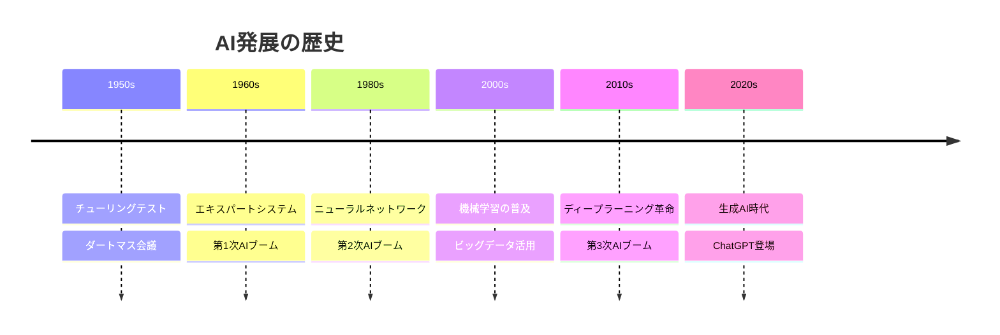
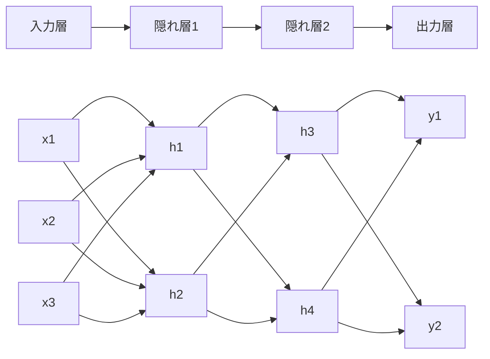
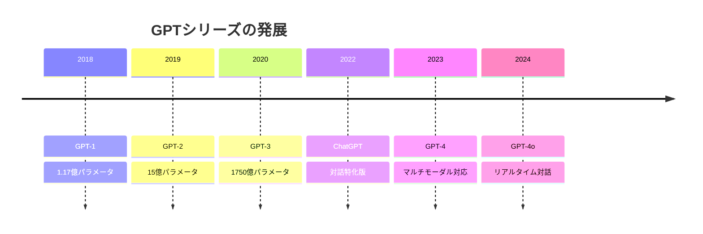
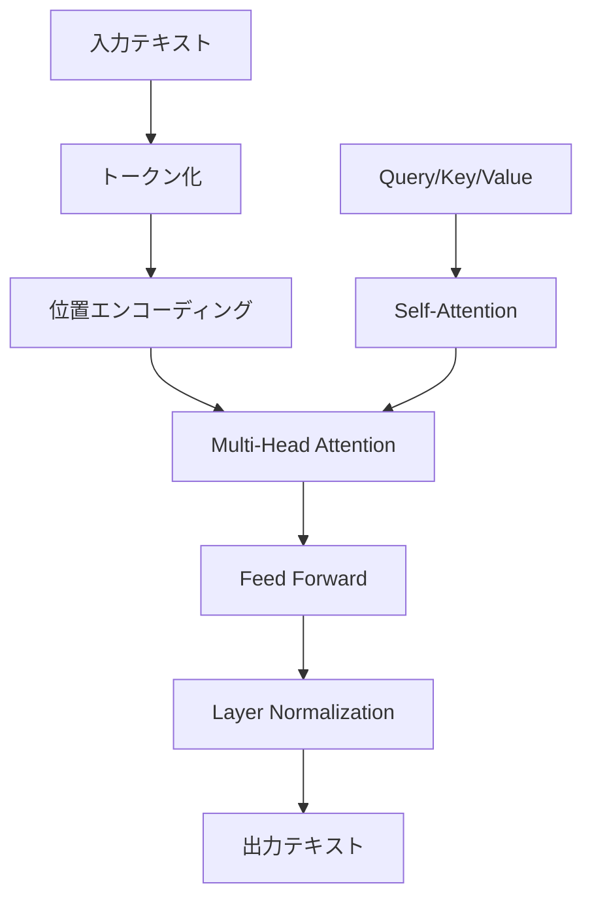
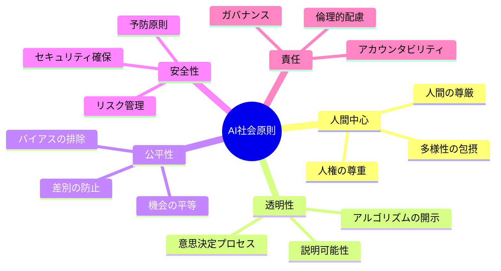
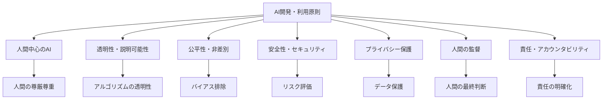

<style>
.text-gradient {
  background: linear-gradient(90deg, #f59e0b, #10b981, #3b82f6);
  -webkit-background-clip: text;
  background-clip: text;
  color: transparent;
}
</style>

# 生成AI検定対応講義

## 人工知能から生成AIまでの包括理解

<div class="pt-12">
  <span @click="$slidev.nav.next" class="px-2 py-1 rounded cursor-pointer" hover="bg-white bg-opacity-10">
    講義を開始する <carbon:arrow-right class="inline"/>
  </span>
</div>

---
layout: default
---

# 講義の構成

<div class="grid grid-cols-2 gap-4">

<div>

## 第1章: AI（人工知能）の基礎
- AIの定義と歴史
- 機械学習の基本概念
- 弱いAIと強いAI
- シンギュラリティ

## 第2章: 生成AI（ジェネレーティブAI）
- 生成モデルの発展
- ChatGPTとGPTモデル
- 各種生成AI（テキスト、画像、音声、動画）
- ディープフェイク技術

</div>

<div>

## 第3章: 情報リテラシーとAI社会原則
- インターネットリテラシー
- セキュリティとプライバシー
- 個人情報保護と知的財産権
- AI社会の基本理念

## 第4章: プロンプトエンジニアリング
- LMとLLMの理解
- プロンプティングの基礎
- ビジネス応用事例
- 生成AIの限界

</div>

</div>

---
layout: image-right
image: https://source.unsplash.com/800x600/?artificial-intelligence
---

# 第1章: AI（人工知能）の基礎

## AIの定義

**人工知能（AI）**とは、人間の知的な活動を機械で模倣・実現する技術

### 主要な特徴
- **学習能力**: データから規則性を発見
- **推論能力**: 論理的思考の実現
- **認識能力**: パターン認識と分類
- **創造能力**: 新しいコンテンツの生成

### AIの分類
- **弱いAI（Narrow AI）**: 特定タスクに特化
- **強いAI（AGI）**: 人間レベルの汎用知能
- **超知能（ASI）**: 人間を超える知能

---

# AIの歴史的発展



---

# 機械学習の基本概念

<div class="grid grid-cols-3 gap-6">

<div class="bg-blue-100 p-4 rounded">

## 教師あり学習
- **分類**: カテゴリ予測
- **回帰**: 数値予測
- **例**: 画像認識、価格予測

</div>

<div class="bg-green-100 p-4 rounded">

## 教師なし学習
- **クラスタリング**: グループ化
- **次元削減**: データ圧縮
- **例**: 顧客セグメント分析

</div>

<div class="bg-purple-100 p-4 rounded">

## 強化学習
- **報酬最大化**: 試行錯誤学習
- **環境との相互作用**
- **例**: ゲームAI、自動運転

</div>

</div>

---

# ニューラルネットワークの基礎



---

# 第2章: 生成AI（ジェネレーティブAI）

## 生成AIとは

**新しいコンテンツを創造するAI技術**

### 主要な生成モデル
- **GAN（敵対的生成ネットワーク）**: 画像生成
- **VAE（変分オートエンコーダ）**: データ生成
- **Transformer**: テキスト生成
- **Diffusion Model**: 高品質画像生成

### 生成可能なコンテンツ
- テキスト（文章、コード、詩）
- 画像（写真、イラスト、デザイン）
- 音声（音楽、効果音、音声合成）
- 動画（映像、アニメーション）

---

# 生成AI技術の比較

| 技術 | 特徴 | 用途 | 代表例 |
|------|------|------|--------|
| **GAN** | 敵対的学習 | 画像生成 | StyleGAN |
| **VAE** | 確率的生成 | データ圧縮・生成 | β-VAE |
| **Transformer** | 注意機構 | テキスト生成 | GPT-4 |
| **Diffusion** | ノイズ除去 | 高品質画像 | DALL-E 3 |
| **RNN/LSTM** | 系列モデル | 時系列生成 | 音楽生成 |

---

# GPTモデルの進化



---

# Transformerアーキテクチャ



**注意機構（Attention）**により長期依存関係を効率的に学習

---

# 生成AIの応用分野

<div class="grid grid-cols-2 gap-6">

<div>

## テキスト生成
- **文章作成**: 記事、レポート
- **コード生成**: プログラミング支援
- **翻訳**: 多言語対応
- **要約**: 長文の要点抽出

## 画像生成
- **アート作成**: デジタルアート
- **デザイン**: ロゴ、UI設計
- **写真編集**: 修復、加工
- **3Dモデル**: 立体造形

</div>

<div>

## 音声・音楽
- **音声合成**: TTS技術
- **音楽作曲**: BGM生成
- **効果音**: ゲーム・映像用
- **音声変換**: 声質変更

## 動画・映像
- **動画生成**: ショート動画
- **アニメーション**: キャラクター動作
- **映像編集**: 自動カット
- **特殊効果**: VFX生成

</div>

</div>

---

# 第3章: 情報リテラシーとAI社会原則

## インターネットリテラシー

### 情報の信頼性評価
- **情報源の確認**: 公式サイト、専門機関
- **複数ソースの照合**: クロスチェック
- **更新日時の確認**: 最新性の検証
- **バイアスの認識**: 偏見や先入観

### デジタル足跡の管理
- **プライバシー設定**: SNS、アプリ
- **個人情報の保護**: 適切な開示範囲
- **デジタル遺産**: アカウント管理

---

# セキュリティとプライバシー

<div class="grid grid-cols-2 gap-6">

<div class="bg-red-50 p-4 rounded">

## セキュリティリスク
- **フィッシング攻撃**
- **マルウェア感染**
- **パスワード漏洩**
- **ソーシャルエンジニアリング**

### 対策
- 強固なパスワード
- 二要素認証
- 定期的なアップデート
- セキュリティソフト

</div>

<div class="bg-blue-50 p-4 rounded">

## プライバシー保護
- **個人データの最小化**
- **同意に基づく収集**
- **透明性の確保**
- **データポータビリティ**

### GDPR原則
- 合法性、公正性、透明性
- 目的の限定
- データの最小化
- 正確性の確保

</div>

</div>

---

# 知的財産権とAI

## 著作権の課題

### AI生成コンテンツの権利
- **創作者の定義**: 人間 vs AI
- **学習データの権利**: 著作権侵害リスク
- **生成物の帰属**: 利用者 vs 開発者

### 法的論点
- **フェアユース**: 教育・研究目的
- **変形的利用**: 創造的変換
- **商用利用**: 営利目的の制限

## 特許権への影響
- **AI発明**: 特許適格性
- **発明者の定義**: 自然人要件
- **新規性・進歩性**: AI支援発明

---

# AI社会の基本理念



---

# AIバイアスと公平性

## バイアスの種類

<div class="grid grid-cols-2 gap-4">

<div>

### データバイアス
- **サンプリングバイアス**: 偏った収集
- **歴史的バイアス**: 過去の差別反映
- **表現バイアス**: 不適切な代表性

### アルゴリズムバイアス
- **確証バイアス**: 仮説の強化
- **選択バイアス**: 特定グループ優遇
- **評価バイアス**: 指標の偏り

</div>

<div>

### 対策手法
- **多様なデータ収集**
- **バイアス検出ツール**
- **公平性指標の導入**
- **継続的モニタリング**

### 評価指標
- **統計的パリティ**
- **機会の平等**
- **予測パリティ**
- **個人公平性**

</div>

</div>

---

# 第4章: プロンプトエンジニアリング

## LMとLLMの理解

### 言語モデル（LM）の基礎
- **統計的言語モデル**: N-gram
- **ニューラル言語モデル**: RNN/LSTM
- **事前学習モデル**: BERT、GPT

### 大規模言語モデル（LLM）
- **パラメータ数**: 数十億〜数兆
- **学習データ**: インターネット規模
- **創発能力**: 予期しない性能向上
- **汎用性**: 多様なタスク対応

---

# プロンプトエンジニアリングの基礎

## 効果的なプロンプト設計

### 基本原則
1. **明確性**: 具体的で曖昧さのない指示
2. **文脈提供**: 必要な背景情報
3. **例示**: Few-shot learning
4. **制約指定**: 出力形式や長さ

### プロンプトの構成要素
- **役割設定**: "あなたは専門家です"
- **タスク説明**: 具体的な作業内容
- **入力データ**: 処理対象の情報
- **出力形式**: 期待する結果の形

---

# プロンプト技法の種類

<div class="grid grid-cols-2 gap-6">

<div>

## Zero-shot
```
以下の文章を要約してください：
[文章]
```

## Few-shot
```
例1: [入力] → [出力]
例2: [入力] → [出力]

以下を同様に処理：
[新しい入力]
```

</div>

<div>

## Chain-of-Thought
```
段階的に考えてください：
1. まず...
2. 次に...
3. 最後に...
```

## Role Playing
```
あなたは経験豊富な
マーケティング専門家です。
以下の商品について...
```

</div>

</div>

---

# プロンプトエンジニアリング実例

```python
prompt = """
あなたは優秀なPython開発者です。
以下の要件を満たす関数を作成してください：

要件：
- 入力: Pandas DataFrame
- 処理: 欠損値を処理し標準化
- 出力: 処理済みDataFrame

制約：
- コードのみ出力
- コメントは日本語
- エラーハンドリング含む
"""
```

---

# ビジネス応用事例

<div class="grid grid-cols-3 gap-4">

<div class="bg-blue-50 p-4 rounded">

## マーケティング
- **コピーライティング**
- **SNS投稿生成**
- **商品説明文**
- **広告文案作成**

</div>

<div class="bg-green-50 p-4 rounded">

## カスタマーサポート
- **FAQ自動生成**
- **チャットボット**
- **問い合わせ分類**
- **回答テンプレート**

</div>

<div class="bg-purple-50 p-4 rounded">

## 業務効率化
- **議事録作成**
- **レポート生成**
- **メール下書き**
- **データ分析支援**

</div>

</div>

---

# 生成AIの限界と課題

## 技術的限界

### ハルシネーション（幻覚）
- **事実と異なる情報生成**
- **もっともらしい嘘**
- **検証の重要性**

### コンテキスト制限
- **入力長の上限**
- **長期記憶の欠如**
- **一貫性の問題**

### バイアスと偏見
- **学習データの偏り**
- **社会的ステレオタイプ**
- **文化的偏見**

---

# 生成AIのリスクと対策

<div class="grid grid-cols-2 gap-6">

<div class="bg-red-50 p-4 rounded">

## 主要リスク
- **ディープフェイク**: 偽情報拡散
- **著作権侵害**: 無断学習・生成
- **プライバシー侵害**: 個人情報漏洩
- **雇用への影響**: 職業の代替
- **悪用可能性**: サイバー攻撃

</div>

<div class="bg-blue-50 p-4 rounded">

## 対策・ガイドライン
- **技術的対策**: 透かし、検出技術
- **法的規制**: AI法、ガイドライン
- **倫理的配慮**: 開発・利用原則
- **教育・啓発**: リテラシー向上
- **国際協力**: グローバル標準

</div>

</div>

---

# AI開発・利用の原則



---

# 生成AI検定のポイント

## 重要な学習項目

<div class="grid grid-cols-2 gap-4">

<div>

### 技術理解
- **生成モデルの種類と特徴**
- **Transformerアーキテクチャ**
- **学習手法（教師あり/なし/強化）**
- **評価指標と性能測定**

### 応用知識
- **プロンプトエンジニアリング**
- **ファインチューニング**
- **RAG（検索拡張生成）**
- **マルチモーダルAI**

</div>

<div>

### 社会・倫理
- **AI倫理と社会原則**
- **バイアスと公平性**
- **プライバシーと著作権**
- **リスク管理**

### 実践スキル
- **適切な利用方法**
- **品質評価**
- **セキュリティ対策**
- **継続学習**

</div>

</div>

---

# 生成AIの未来展望

## 技術発展の方向性

### 短期（1-2年）
- **マルチモーダル統合**: テキスト+画像+音声
- **リアルタイム対話**: 低遅延応答
- **専門分野特化**: 医療、法律、教育
- **効率化**: 軽量モデル、エッジAI

### 中期（3-5年）
- **AGI（汎用人工知能）への接近**
- **自律的学習**: 継続的改善
- **創造性の向上**: より独創的な生成
- **社会実装**: インフラ統合

---

# まとめ：生成AI時代を生きる

<div class="grid grid-cols-3 gap-6">

<div class="text-center">

## 🎯 理解
**技術の本質を把握**
- 仕組みの理解
- 可能性と限界
- 適用領域の見極め

</div>

<div class="text-center">

## 🛡️ 責任
**倫理的な利用**
- 社会への影響考慮
- プライバシー尊重
- 公平性の確保

</div>

<div class="text-center">

## 🚀 活用
**創造的な応用**
- 業務効率化
- 新しい価値創造
- 継続的学習

</div>

</div>

### 生成AIは道具です。重要なのは、それをどう使うかです。

---
layout: end
---

# ありがとうございました

## 質疑応答

<div class="mt-12 text-center">
  <div class="text-2xl mb-4">🤖 生成AI検定 頑張ってください！ 🎓</div>
  <div class="text-sm opacity-70">継続的な学習と実践が成功の鍵です</div>
</div>
